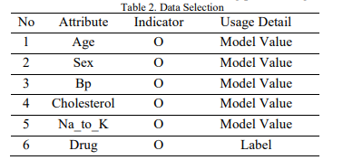
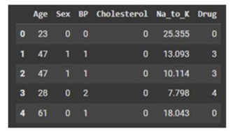
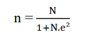
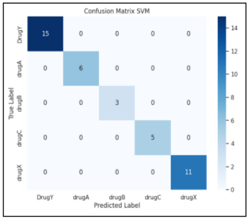
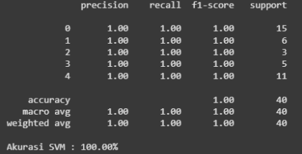

# Analisis Algoritma Support Vector Machine Untuk Klasifikasi Obat Terhadap Pasien
-Project Overview

This project implements a Machine Learning model using the Support Vector Machine (SVM) algorithm to classify drug types based on patient medical data. The system is designed to support healthcare decision-making by predicting the most appropriate drug category for patients using data-driven analysis.

The model analyzes several medical attributes such as age, gender, blood pressure, cholesterol level, and sodium-to-potassium ratio to determine the suitable drug classification.

This project was developed using Python and Google Colab as part of a research study in the field of Artificial Intelligence and Healthcare.

-Research Publication

This project has been published in the Journal of Information and Technology (JIDT) 2025.

Publication Title:
Precision Medicine Through Support Vector Machines: Analyzing Patient Data for Improved Drug Classification

https://jidt.org/jidt/article/view/627

-Objectives

The main objectives of this project are:

1. To implement the Support Vector Machine (SVM) algorithm for drug classification
2. To improve the efficiency and accuracy of drug recommendation processes
3. To demonstrate the application of Artificial Intelligence in healthcare systems
4. To analyze patient medical data using Machine Learning techniques

-Tools & Technologies

Python, Pandas, NumPy, Scikit-learn, Matplotlib, Google Colab, Jupyter Notebook

-Dataset

The dataset used in this project was obtained from a public dataset available on GitHub and contains 200 patient records for drug classification analysis.

The dataset includes the following features:

1. Age
2. Sex
3. Blood Pressure
4. Cholesterol
5. Na_to_K Ratio
6. Drug Category

-Data Collection

The dataset was imported and analyzed to understand the structure, attributes, and target labels.

-Data Preprocessing

Data preprocessing was performed to ensure the dataset quality before model training:

1. Checking missing values
2. Removing duplicated data
3. Data cleaning
4. Feature preparation

-Data Transformation

Categorical features such as gender, blood pressure, and cholesterol level were transformed into numerical values using Label Encoding.

-Train-Test Split

The dataset was divided into:

Training Data: 80%
Testing Data: 20%

To support the research methodology, this study also applied the Slovin Formula to estimate the recommended minimum sample size for analysis.​

Where:

n = Minimum sample size

N = Population size

e = Margin of error

Using:

Population size (N) = 278,000,000

Margin of error (e) = 5% or 0.05

The calculation result indicates that the recommended minimum sample size is approximately 400 data samples.

Although this project used 200 patient records from a GitHub dataset, the data was still sufficient to demonstrate the implementation and evaluation of the Support Vector Machine (SVM) algorithm for drug classification tasks.

-Model Training

The Support Vector Machine (SVM) algorithm was used to train the classification model.

SVM was selected because of its strong performance in classification tasks and its ability to handle multidimensional datasets effectively.

-Model Evaluation

The model performance was evaluated using:

1. Confusion Matrix

Used to analyze the prediction results of the Support Vector Machine (SVM) model on the testing data and compare actual and predicted drug classifications

2. Evaluation

-Accuracy Score

Measures the overall performance of the model. The SVM model achieved 100% accuracy on the testing dataset

-Precision

Measures the correctness of predicted drug classifications. The model achieved a precision score of 100%

-Recall

Measures the model’s ability to correctly identify all actual drug categories. The recall result reached 100%

-F1-Score

Evaluates the balance between precision and recall. The model achieved an F1-score of 100%.

# Results and Insights

The Support Vector Machine (SVM) model achieved 100% accuracy on the testing dataset and successfully classified all drug categories without prediction errors.

The results indicate that SVM is highly effective for medical data classification tasks and has strong potential for supporting healthcare decision-making systems through accurate drug recommendation analysis.
